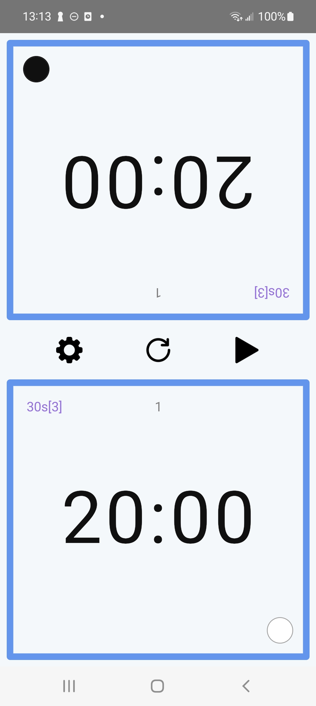
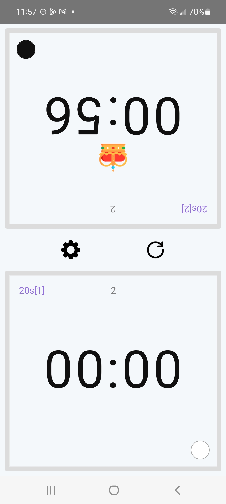
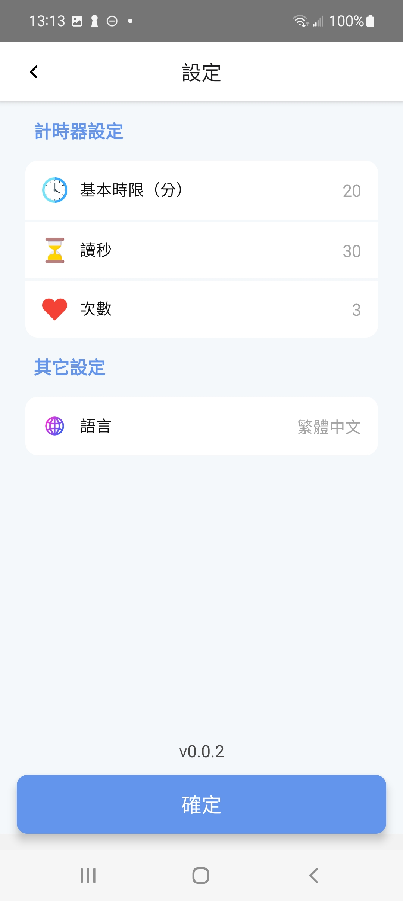
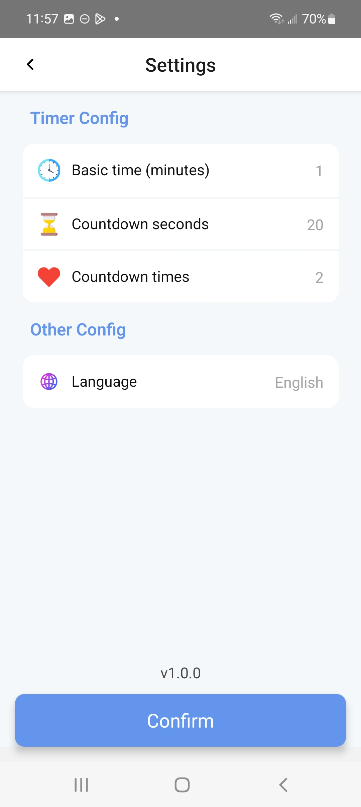

# Go Timer

A timer for board game players with voice alerts. Essential for Go enthusiasts.

## Documentation

- [Install](#install)
- [Release android](#release-android)
- [Features](#features)
- [Store](#store)
- [App icon generator](#app-icon-generator)

## Install

```shell
yarn install
npm run pod:install
```

## Release android

```shell
npm run cp:android
npm run release:android
```

## Features

Initial state<br>


End state<br>


Language ZH<br>


Language EN<br>


## Store

[Google Play](https://play.google.com/store/apps/details?id=com.vito.gotimer)

## App icon generator

[iOS](https://www.appicon.co/)<br>
[Android](<https://romannurik.github.io/AndroidAssetStudio/icons-launcher.html#foreground.type=clipart&foreground.clipart=android&foreground.space.trim=1&foreground.space.pad=0.25&foreColor=rgba(96%2C%20125%2C%20139%2C%200)&backColor=rgb(68%2C%20138%2C%20255)&crop=0&backgroundShape=circle&effects=none&name=ic_launcher>)
